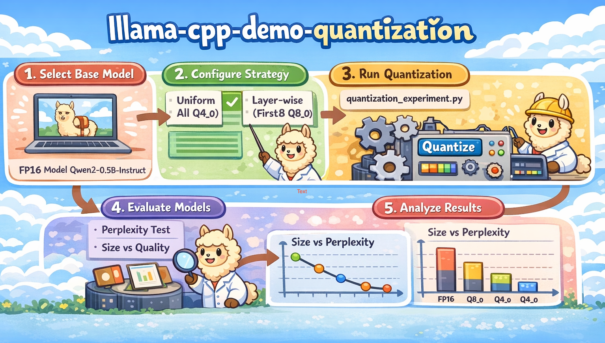
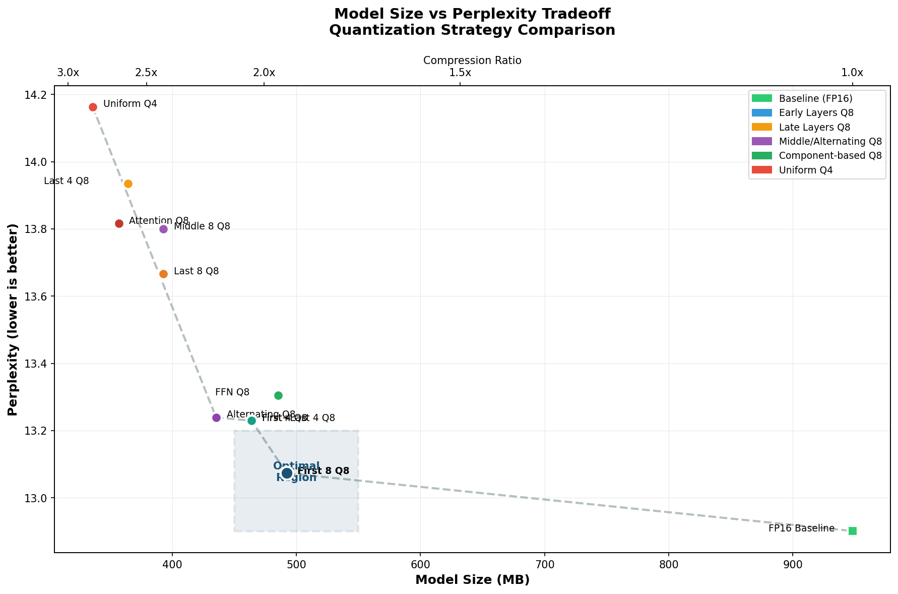

# Quantization Layer Placement Experiment

An empirical study investigating how the placement of quantized layers affects language model inference quality.

## Motivation

When quantizing large language models, a common approach is to apply uniform quantization across all layers. However, different layers may have varying sensitivity to precision reduction. This experiment explores whether strategic placement of higher-precision layers can improve model quality while maintaining compression benefits.

**Research Question**: Given a fixed budget of layers to keep at higher precision, which layers should we prioritize?

## Experimental Setup

### Model
- **Architecture**: Qwen2-0.5B-Instruct
- **Layers**: 24 transformer blocks
- **Base precision**: FP16 (948 MB)

### Tools
- **llama.cpp** (v7920) for quantization and inference
- **llama-quantize** with `--tensor-type` flag for per-layer precision control
- **llama-perplexity** for evaluation

### Evaluation
- **Dataset**: WikiText-2 test set
- **Metric**: Perplexity (lower is better)
- **Chunks**: 5 (context size 512)

## Methodology

### Experiment Workflow



The experiment follows a systematic pipeline: starting with the base FP16 model, we apply 10 different quantization strategies using llama.cpp's `--tensor-type` flag for layer-wise precision control, then evaluate each configuration using perplexity on WikiText-2.

### Quantization Strategies

We tested 10 quantization strategies, all using Q4_0 as the base quantization with selected layers kept at Q8_0:

| Strategy | Description | Layers at Q8 |
|----------|-------------|--------------|
| `baseline_fp16` | No quantization | All (FP16) |
| `uniform_q4_0` | All layers Q4 | None |
| `first_4_layers_q8` | Early layers protected | 0-3 |
| `first_8_layers_q8` | More early layers protected | 0-7 |
| `last_4_layers_q8` | Late layers protected | 20-23 |
| `last_8_layers_q8` | More late layers protected | 16-23 |
| `middle_8_layers_q8` | Middle layers protected | 8-15 |
| `first_last_4_layers_q8` | Both ends protected | 0-3, 20-23 |
| `alternating_even_q8` | Distributed protection | 0,2,4,...,22 |
| `attention_q8` | All attention weights Q8 | attn_q/k/v/output |
| `ffn_q8` | All FFN weights Q8 | ffn_up/gate/down |

## Results

### Summary Table

All quantized configurations use **Q4_0 as base** with selected layers/components kept at **Q8_0** for higher precision. More Q8 layers → larger size (Q8 ≈ 8 bits/weight vs Q4 ≈ 4 bits/weight):

| Configuration | Size (MB) | Perplexity | PPL Δ | Compression |
|--------------|-----------|------------|-------|-------------|
| FP16 Baseline | 948 | 12.90 | - | 1.0x |
| **Q4_0 + first 8 layers Q8** | **492** | **13.07** | **+1.3%** | **1.9x** |
| Q4_0 + first 4 layers Q8 | 464 | 13.23 | +2.5% | 2.0x |
| Q4_0 + first+last 4 layers Q8 | 464 | 13.23 | +2.5% | 2.0x |
| Q4_0 + alternating layers Q8 | 435 | 13.24 | +2.6% | 2.2x |
| Q4_0 + FFN Q8 | 485 | 13.31 | +3.1% | 2.0x |
| Q4_0 + last 8 layers Q8 | 393 | 13.67 | +5.9% | 2.4x |
| Q4_0 + middle 8 layers Q8 | 393 | 13.80 | +7.0% | 2.4x |
| Q4_0 + attention Q8 | 357 | 13.82 | +7.1% | 2.7x |
| Q4_0 + last 4 layers Q8 | 364 | 13.93 | +8.0% | 2.6x |
| Uniform Q4_0 | 336 | 14.16 | +9.8% | 2.8x |

### Visualization

#### Model Size vs Perplexity Tradeoff



This figure shows the tradeoff between model size (compression) and perplexity (quality). The optimal region highlights the `first_8_layers_q8` strategy, which achieves excellent compression with minimal quality loss.

#### Perplexity by Configuration

```
Perplexity by Configuration (lower is better)
Base: Q4_0, selected layers at Q8_0
─────────────────────────────────────────────────────────────────

FP16 Baseline              |█ 12.90
Q4_0 + first 8 layers Q8   |██████ 13.07        ← Best quantized
Q4_0 + first 4 layers Q8   |████████████ 13.23
Q4_0 + first+last 4 Q8     |████████████ 13.23
Q4_0 + alternating Q8      |█████████████ 13.24
Q4_0 + FFN Q8              |███████████████ 13.31
Q4_0 + last 8 layers Q8    |██████████████████████████████ 13.67
Q4_0 + middle 8 layers Q8  |███████████████████████████████████ 13.80
Q4_0 + attention Q8        |███████████████████████████████████ 13.82
Q4_0 + last 4 layers Q8    |████████████████████████████████████████ 13.93
Uniform Q4_0               |█████████████████████████████████████████████████ 14.16
```

## Key Findings

### 1. Early Layers Are Most Sensitive to Quantization

The most significant finding is that **early layers benefit more from higher precision** than late layers:

- First 4 layers at Q8: PPL = 13.23 (+2.5%)
- Last 4 layers at Q8: PPL = 13.93 (+8.0%)
- **Difference: 0.70 perplexity points**

This suggests that early transformer layers capture fundamental features (token embeddings, basic patterns) that degrade significantly when quantized aggressively.

### 2. Late Layers Are More Robust

Contrary to the intuition that "output layers need precision for generation," the last layers showed remarkable resilience to quantization. Protecting the last 8 layers provided less benefit than protecting the first 4 layers alone.

### 3. FFN vs Attention Trade-off

| Component | Size | PPL |
|-----------|------|-----|
| FFN at Q8 | 485 MB | 13.31 |
| Attention at Q8 | 357 MB | 13.82 |

FFN layers contain more parameters but keeping them at higher precision yielded better perplexity than attention layers. This is somewhat surprising given attention's role in computing precise similarity scores.

### 4. Optimal Strategy

For this model, the **optimal trade-off** is:

```
Strategy: first_8_layers_q8
- Keep layers 0-7 at Q8_0
- Quantize layers 8-23 to Q4_0
- Result: 1.9x compression with only 1.3% perplexity increase
```

### 5. Diminishing Returns

The relationship between protected layers and quality is not linear:

| Protected Layers | PPL Improvement vs Uniform |
|-----------------|---------------------------|
| First 4 | 0.93 |
| First 8 | 1.09 |
| First 12 (alternating) | 0.92 |

Adding more protected layers shows diminishing returns after the first 8.

## Recommendations

### Memory Constrained (< 400 MB)
```bash
llama-quantize model.gguf output.gguf Q4_0
```
Accept ~10% perplexity increase for maximum compression.

### Balanced Quality/Size (400-500 MB)
```bash
llama-quantize \
  --tensor-type blk.0=q8_0 \
  --tensor-type blk.1=q8_0 \
  --tensor-type blk.2=q8_0 \
  --tensor-type blk.3=q8_0 \
  --tensor-type blk.4=q8_0 \
  --tensor-type blk.5=q8_0 \
  --tensor-type blk.6=q8_0 \
  --tensor-type blk.7=q8_0 \
  model.gguf output.gguf Q4_0
```
Best quality-to-size ratio with 1.3% perplexity increase.

### Quality Focused
Keep more early layers at Q8 or use Q5_K_M as the base quantization.

## Reproducing the Experiment

### Prerequisites
```bash
# Install llama.cpp
brew install llama.cpp

# Or build from source
git clone https://github.com/ggerganov/llama.cpp
cd llama.cpp && make
```

### Download Model
```bash
mkdir -p models
curl -L -o models/qwen2-0.5b-instruct-fp16.gguf \
  "https://huggingface.co/Qwen/Qwen2-0.5B-Instruct-GGUF/resolve/main/qwen2-0_5b-instruct-fp16.gguf"
```

### Run Experiment
```bash
python3 quantization_experiment.py
python3 visualize_results.py
```

## File Structure

```
llama-cpp-demo/
├── README.md                      # This report
├── quantization_experiment.py     # Main experiment script
├── visualize_results.py           # Analysis and visualization
├── plot_figures.py                # Generate visualization figures
├── run_quantization_experiment.sh # Shell script alternative
├── models/
│   └── qwen2-0.5b-instruct-fp16.gguf
└── results/
    ├── quantization_results.json  # Raw experiment data
    ├── wikitext-test.txt          # Evaluation dataset
    ├── model_size_perplexity_tradeoff.png  # Size vs PPL plot
    └── cover-2.png                # Workflow diagram
```

## Limitations

1. **Single model**: Results are from Qwen2-0.5B only; different architectures may behave differently
2. **Single metric**: Perplexity on WikiText-2; task-specific performance may vary
3. **Limited scale**: Small model (0.5B); larger models may show different layer sensitivity patterns
4. **Q4 vs Q8 only**: Did not test intermediate precisions (Q5, Q6)
the early layers first.

## References

- [llama.cpp GitHub](https://github.com/ggerganov/llama.cpp)
- [Qwen2 Model](https://huggingface.co/Qwen/Qwen2-0.5B-Instruct-GGUF)
- [GGUF Quantization Documentation](https://github.com/ggerganov/llama.cpp/blob/master/tools/quantize/README.md)
